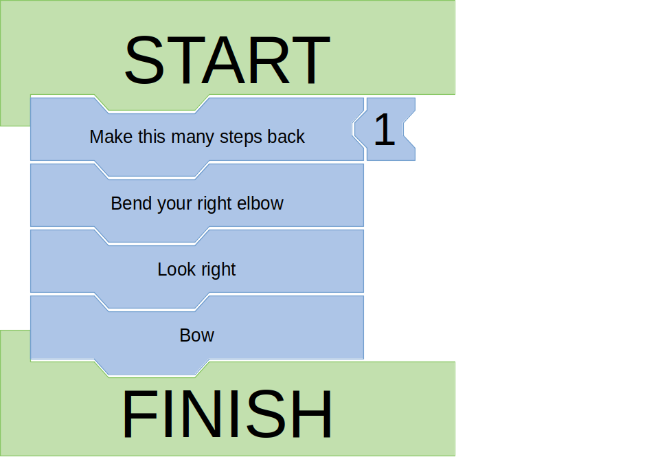
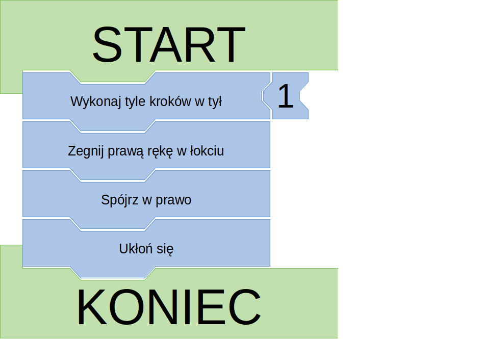

# [EN] Dancing Robots

A simple game for children to present some elements of programming. All ideas are very welcome. Currently English and Polish versions are available, feel free to prepare a version in your language.

This is released under CC-BY-SA-4.0 license. See [LICENSE](LICENSE) for details

## Preparation 

1. Print out the document. Plain paper will work fine but thicker one will be easier to play with.
1. Cut the blocks out.
1. Prepare a pen to fill in the blank instructions.
1. Prepare some music for the game.

## Rules

The game can be played by at least one person. At least one person playing needs to be able to read (or an assisting person is needed).

### The blocks
* I tried to make the blocks rather intuitive so I have used the concept found in jigsaw puzzles with tabs and blanks that match when properly combined. Wider tabs and blanks are used for sequences and are placed on top or bottom of a block, narrower tabs and blanks are used for additional information for a block (like numbers or end conditions).
* A dance starts with a `START` block and ends with a `FINISH` block. It introduces a small indent in the blocks line.
* A dance can contain a loop with use of `REPEAT` block. It also introduces a small indent in the blocks line for clarity. The indent is ended with use of the `END OF REPEAT BLOCK`.
* There are some basic steps available in the game. Some of them can or should be expanded with use of digits or end conditions.
* The digit block can be combined into a larger number in the same interlocking way. You can also use the end conditions like `Until the song ends`.

### Starting the game

The game has simple basic rules:
1. Select the robot. You can pull the straws, roll a dice, draw a card or any other method
1. Prepare the dance (more on that later)
1. Play the music
1. The robot performs
1. Repeat

The rules can be extended.

### Preparing the dance
We started playing by drawing random step blocks and combining them together - each person in the game would draw one step and put it in the sequence. There can be other methods though:
* time constrained dance preparation by everyone
* the robot prepares its own dance
* a choreographer is selected

Remember new blocks can be introduced and written on. If they are interesting, be sure to create an issue with suggestions

### Adding more roles
In bigger groups you can add more roles:
* Choreographer - a person that prepares the dance
* Reader - a person that reads the dance instructions to the robot
* Arbiter - a person solving the unclear situations and conflicts. An arbiter's role is to make sure the rules are obeyed but can also decide to alter the rules if the groups wants it

### Things may not work
The rules are not covering every case, the roles may be unclear, the blocks could be assembled with a bug, it could be that the dance never ends. It is all intentional (or not) part of the learning experience. If you can, have a look at the outcomes. Discuss them with the players.

I would love to hear what problems you ran into. I'll be very happy to provide them here.

## Contributing
The whole game has been prepared with use of [LibreOffice Draw](https://www.libreoffice.org/). Feel free to fork the repository, prepare changes and submit them as pull requests. You can also simply create an issue describing what could be improved.

Translatons are very welcome as well.

# [PL] Tańczące roboty

Prosta gra dla dzieci, prezentująca elementy programowania. Wszystkie pomysły są mile widziane. Obecnie dostępne jedynie wersje polska i angielska, z przyjemnością opublikuję inne wersje językowe.

Całość została opublikowana na licencji CC-BY-SA-4.0. Zobacz [LICENSE (po angielsku)](LICENSE) aby poznać szczegóły.

## Przygotowania 

1. Wydrukuj dokument. Możesz na zwykłym papierze, ale grubsze kartki lepiej sprawdzą się w zabawie.
1. Wytnij bloki.
1. Przygotuje pisadło, aby wypełniać puste bloki.
1. Przygotuj muzykę do gry.

## Zasady

Gra może być grana przez co najmniej jedną osobę. Co najmniej jeden uczestnik musi umieć czytać (lub potrzebna jest osoba asystująca).

### Bloki
* Starałem się przygotować bloki wykorzystując koncept puzli, z pasującymi do siebie w prawidłowych scenariuszach wypustkami i wcięciami. Szersze wypustki i wcięcia użyte są do składania sekwencji, węższe - do podania dodatkowej informacji dla bloku (na przykład numery lub warunki końcowe).
* Taniec zaczna się blokiem `START` i kończy blokiem `KONIEC`. Ta para tworzy małe wcięcie dla pozostałych bloków w tańcu.
* Taniec może zawierać pętlę z użyciem bloku `POWTÓRZ`. W pętli bloki również są nieco wcięte w stosunku do pozostałych bloków. Wcięcie kończy się gdy użyty zostanie blok `KONIEC POWTARZANIA`.
* Dostępne są podstawowe kroki do wykorzystania w grze. Część z nich może lub musi być rozszerzona z użyciem cyfr lub warunków końcowych.
* Bloki cyfr mogą być łączone w większą liczbę z wykorzystaniem tego samego mechanizmu wcięć i wypustków. Możesz również wykorzystać warunki końcowe, takie jak `Do końca piosenki`.

### Rozpoczęcie gry

Podstawowe zasady gry są bardzo proste
1. Wybierz robota. Można ciągnąć zapałki, rzucić kostką, wybrać kartę lub użyć dowolnej innej metody
1. Przygotuj taniec (opisane poniżej)
1. Uruchom muzykę
1. Robot tańczy
1. Powtórz

W zależności od potrzeby zasady można rozszerzyć

### Przygotowanie tańca
My bawiliśmy się losując kroki w grze - każda osoba losowała jeden ruch i umieszczała go w tańcu. Można jednak użyć innych metod:
* wszyscy ustalają taniec (z ograniczeniem czasowym)
* robot sam przygotowuje swój taniec
* wybrany zostaje choreograf

Pamiętaj że na pustych blokach można zapisać nowe ruchy. Jeśli masz interesujące pomysły, utwórz nowe Issue z sugestiami

### Dodawanie nowych ról
W większych grupach można nadać osobom więcej ról:
* Choreograf - przygotowuje taniec
* Lektor - osoba odczytująca taniec dla robota
* Arbiter - osoba rozwiązująca konflikty i decydująca w niejasnych sytuacjach. Rolą arbitra jest pilnować, aby uczestnicy trzymali się zasad, ale może on też zmienić zasady jeśli grupa tego chce

### Coż może nie wyjść
Reguły nie opisują każdego przypadku, role mogą nie być wyklarowane, bloki mogą być złożone z błędem, a może taniec nigdy nie zostanie ukończony. To wszystko to celowa (lub nie) część edukacyjnego aspektu gry. Jeśli możesz, obserwuj rezultaty gry. Przedyskutuje je z graczami.

Chętnie poznam problemy, które napotkaliście i umieszczę je w tym dokumencie.

## Pomoc przy projekcie
Gra została przygotowana z użyciem [LibreOffice Draw](https://www.libreoffice.org/). Jeśli chcesz, wykonaj fork repozytorium, przygotuj zmiany i zgłoś je jako poll request. Możesz też zgłosić issue z propozycjami zmian.

Tłumaczenia są również mile widziane/
